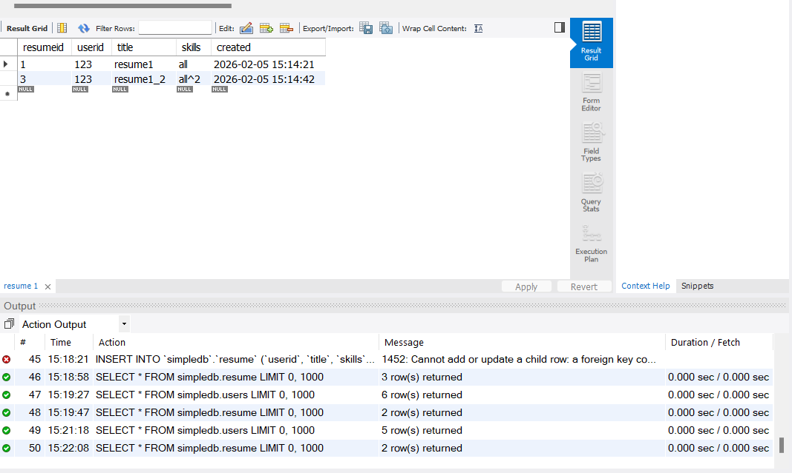

Выполнил Фролов А.А. 2-к., ИВТ-2

## Описание функций

#### Раздел “Management”

**Раздел “Server Status”.** 
В разделе отображается общая информация о сервере и подключении к нему. Информация логически сгруппирована. Можно выделить следующие группы: 
1. Общая информация (например, название хоста, номер порта, версия БД).
2. Настройки сервера (например, включен ли брандмауэр, используется ли SSL)
3. Каталоги сервера
4. Сводка по используемым ресурсам компьютера (ОЗУ, процессор и т. д.)
5. Настройки соединения SSL (если SSL включена).

**Раздел “Client Connections”.** 
В разделе отображается информация о подключениях в виде таблицы. 

**Раздел "Users and Privileges"** 
Раздел для настройки пользователей. В левой части список пользователей для выбора. В правой части окно для редактирования полномочий, который включает вкладки:
1. *Login* - данные авторизации
2. *Account Limits* - настройка максимально допустимых значений для работы с БД
3. *Administrative Roles* - права администратора
4. *Schema Privileges* - права для работы со схемами

**Раздел "Status and Sysem Variables"**
Раздел с переменными. В левой части категории в правой части окно с переменными в выбранной категории.

**Раздел "Data Export"**
Раздел для экспорта данных. Есть две вкладки:
1. *Object selection* - для настроек экспорта
2. *Export progress* - для отслеживания процесса

**Раздел "Data Import/Restore"**
Раздел для импорта данных. Есть две вкладки:
1. *Import from Disk* - настройка импорта
2. *Import Progress* - отслеживание прогресса импорта

#### Раздел “Instance”

**Раздел "Startup/Shutdown"**
Окно отображающее статус сервера, позволяющее запускать и останавливать его. Так же есть окно *Startup Message Log* с логами.

**Раздел "Server Logs"**
Раздел с логами.
1. *Error Log  File* - вкладка с Error - логами
2. *Slow Log FIle* - вкладка с Slow - логами

**Раздел "Options File"**
Отображает всевозможные настройки. Есть такие вкладки настроек как:
1. Основные
2. Авторизация
3. InnoDB
4. Сетевые
5. Расширенные
6. Другие
7. Безопасность
8. Репликация
9. MyISAM
10. Производительность
Так же есть функция поиска нужной настройки.

#### Раздел "Perfomance"

**Раздел "Dashboard"**
Отображает различные графики статусов сети, MySQL, InnoDB

**Раздел "Perfomance Reports"**
Данные по различным пунктам производительности.

**Раздел "Perfomance Schema Setup"**


## Работа с БД

**Команда cоздания БД:**
```sql
CREATE SCHEMA `simpledb` DEFAULT CHARACTER SET utf8 ;
```

**Команда создания таблицы:**
```sql
CREATE TABLE `users` (
  `id` int NOT NULL AUTO_INCREMENT,
  `name` varchar(45) NOT NULL,
  `email` varchar(45) NOT NULL,
  PRIMARY KEY (`id`),
  UNIQUE KEY `email_UNIQUE` (`email`)
) ENGINE=InnoDB DEFAULT CHARSET=utf8mb3;
```

**Команды добавления записей:**
```sql
INSERT INTO `simpledb`.`users` (`name`, `email`) VALUES ('Petr', 'petr@mail.ru');
INSERT INTO `simpledb`.`users` (`name`, `email`) VALUES ('Ivan', 'ivan@mail.ru');
INSERT INTO `simpledb`.`users` (`name`, `email`) VALUES ('Alex', 'alex@mail.ru');
```

**Обновление полей:**
```sql
UPDATE `simpledb`.`users` SET `email` = 'petr_ new@mail.ru' WHERE (`id` = '1');
```

**Дополнение таблицы:**
```sql
LTER TABLE `simpledb`.`users` 
ADD COLUMN `gender` ENUM('M', 'F') NOT NULL AFTER `email`,
ADD COLUMN `bday` DATE NULL DEFAULT NULL AFTER `gender`,
ADD COLUMN `postal_code` VARCHAR(10) NULL DEFAULT 'Null' AFTER `bday`,
ADD COLUMN `rating` FLOAT NULL DEFAULT NULL AFTER `postal_code`,
ADD COLUMN `created` TIMESTAMP NULL DEFAULT CURRENT_TIMESTAMP() AFTER `rating`,
CHANGE COLUMN `name` `name` VARCHAR(50) NOT NULL ;
```

CURRENT_TIMESTAMP() присваивает время в которое выполнен запрос

**Содержимое файла по users:**
```sql
/*
-- Query: SELECT * FROM simpledb.users
LIMIT 0, 1000

-- Date: 2026-02-05 11:20
*/
INSERT INTO `` (`id`,`name`,`email`,`gender`,`bday`,`postal_code`,`rating`,`created`) VALUES (1,'Petr','petr_ new@mail.ru','M',NULL,'Null',NULL,'2026-02-05 11:11:29');
INSERT INTO `` (`id`,`name`,`email`,`gender`,`bday`,`postal_code`,`rating`,`created`) VALUES (2,'Ivan','ivan@mail.ru','M',NULL,'Null',NULL,'2026-02-05 11:11:29');
INSERT INTO `` (`id`,`name`,`email`,`gender`,`bday`,`postal_code`,`rating`,`created`) VALUES (3,'Alex','alex@mail.ru','M',NULL,'Null',NULL,'2026-02-05 11:11:29');
INSERT INTO `` (`id`,`name`,`email`,`gender`,`bday`,`postal_code`,`rating`,`created`) VALUES (4,'Fedya','fedor@mail.ru','M','1994-06-10','195786',4.9,'2026-02-05 11:15:52');
INSERT INTO `` (`id`,`name`,`email`,`gender`,`bday`,`postal_code`,`rating`,`created`) VALUES (5,'Ekaterina','ekaterina.petrova@outlook.com','F','2000-02-11','145789',1.123,'2026-02-05 11:17:59');
INSERT INTO `` (`id`,`name`,`email`,`gender`,`bday`,`postal_code`,`rating`,`created`) VALUES (6,'Paul','paul@superpochta.ru','M','1998-08-12','123789',1,'2026-02-05 11:18:20');
```
Содержит команды по заполнению каждой строки

**Связывание таблиц ключом:**
```
ALTER TABLE `simpledb`.`resume` 
ADD INDEX `userid_idx` (`userid` ASC) VISIBLE;
;
ALTER TABLE `simpledb`.`resume` 
ADD CONSTRAINT `userid`
  FOREIGN KEY (`userid`)
  REFERENCES `simpledb`.`users` (`id`)
  ON DELETE CASCADE
  ON UPDATE CASCADE;
```

**Содержимое файла по заполнению resume:**
```sql
/*
-- Query: SELECT * FROM simpledb.resume
LIMIT 0, 1000

-- Date: 2026-02-05 15:15
*/
INSERT INTO `` (`resumeid`,`userid`,`title`,`skills`,`created`) VALUES (1,1,'resume1','all','2026-02-05 15:14:21');
INSERT INTO `` (`resumeid`,`userid`,`title`,`skills`,`created`) VALUES (2,2,'resume2','none','2026-02-05 15:14:21');
INSERT INTO `` (`resumeid`,`userid`,`title`,`skills`,`created`) VALUES (3,1,'resume1_2','all^2','2026-02-05 15:14:42');

```


Невозможно добавить резюме с id несуществующего пользователя. Выдает ошибку по foreign key:
```sql
Operation failed: There was an error while applying the SQL script to the database.
Executing:
INSERT INTO `simpledb`.`resume` (`userid`, `title`, `skills`) VALUES ('10', 'resume10', 'none');

ERROR 1452: 1452: Cannot add or update a child row: a foreign key constraint fails (`simpledb`.`resume`, CONSTRAINT `userid` FOREIGN KEY (`userid`) REFERENCES `users` (`id`) ON DELETE CASCADE ON UPDATE CASCADE)
SQL Statement:
INSERT INTO `simpledb`.`resume` (`userid`, `title`, `skills`) VALUES ('10', 'resume10', 'none')
```


**Удаление пользователя:**
```sql
DELETE FROM `simpledb`.`users` WHERE (`id` = '2');
```
в таблице запись о резюме пользователя с id=2 удаляется

**Смена id:**
```sql
UPDATE `simpledb`.`users` SET `id` = '123' WHERE (`id` = '1');
```

По action output видим что изменения касаются сразу обеих таблиц, в таблице resume id пользователя поменялось